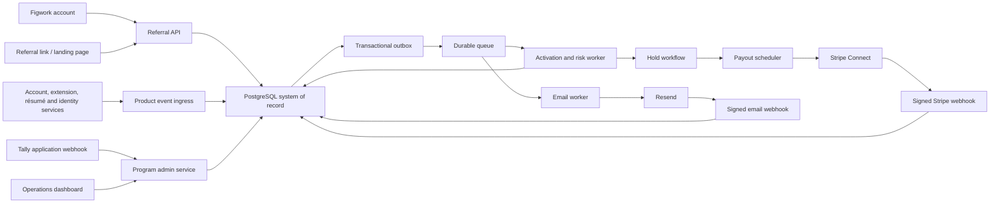

# Referral Program Handoff Specification

Status: implementation-ready design, pending the launch decisions listed in [README.md](./README.md).

## 1. Goals and boundaries

### Goals

- Give every eligible Figwork user one stable personal referral link.
- Attribute a new user to one direct referrer for 14 days.
- Convert trusted product events into a verified activation deterministically.
- Apply the correct $5 or $10 rate without retroactive surprises.
- Give participants a clear tracker without exposing sensitive fraud signals.
- Hold, batch, pay, reconcile, and report rewards safely.
- Support a selected campus cohort without building a second referral engine.
- Let Program Operations investigate and correct edge cases with a complete audit trail.

### Non-goals

- Multi-level or downline rewards.
- Payment for clicks, installs alone, applications, or recruiting other referrers.
- A social-posting quota or required schedule.
- Employment timekeeping, task assignment, or manager reporting.
- Using Tally, the email provider, analytics, or Stripe as the reward system of record.

## 2. User types and permissions

| Actor | Capabilities |
| --- | --- |
| Open referrer | View/copy personal link, see own referral statuses and reward totals, complete payout onboarding, contact support |
| Selected campus participant | Everything above, plus $10 rate for new referrals after selection, brand-kit access, campus-program title permission, and campus-event proposal access |
| Referred person | Follow a referral link and complete the normal Figwork activation path; never sees referrer financial data |
| Program Operations | Review applications, select/remove campus participants, review referrals, approve/reject event proposals, pause payouts, record support decisions |
| Finance | Approve payout batches, reconcile Stripe and bank records, manage tax status, issue adjustments, export reports |
| Trust and Safety | Review fraud signals and appeals without changing commercial terms |
| Support | Read participant and referral timelines; create escalations; cannot approve its own financial adjustments |
| Engineer/on-call | Inspect service health and replay idempotent events; cannot invent ledger entries outside an approved operations workflow |

Use role-based access control. Finance actions above an approved threshold require a second approver. Support must not see W-9 fields, bank details, or raw résumé contents.

## 3. System architecture



### Component responsibilities

**Referral API**

- Creates one non-sequential referral code per user.
- Resolves links without exposing the referrer’s user ID.
- Writes click records and a signed, first-party attribution token.
- Returns participant tracker data from read models.

**Product event ingress**

- Accepts only signed server-to-server events.
- Validates schema and timestamp.
- Stores the raw event envelope once, keyed by event ID.
- Acknowledges quickly; processing is asynchronous.

**Activation and risk worker**

- Joins events by referred user.
- Evaluates attribution, required actions, uniqueness, program rules, and risk.
- Advances state only through allowed transitions.
- Creates a pending reward ledger entry exactly once.

**Hold workflow**

- Waits until `hold_ends_at`.
- Rechecks fraud flags, reversals, payout readiness, and annual cap.
- Marks the reward payable or routes it to review.

**Payout scheduler**

- Groups payable rewards by participant.
- Creates an immutable payout batch.
- Uses a stable Stripe idempotency key.
- Never marks a payout paid from the API response alone; it waits for a verified webhook and reconciliation.

**Program admin service**

- Ingests Tally applications into the internal application queue.
- Records selection as a time-bounded membership.
- Controls brand-kit access and event proposals.
- Never overwrites past referral-rate snapshots.

## 4. Referral link and attribution

### Link format

Use a canonical link such as:

```text
https://figwork.ai/r/{opaque_code}
```

The code should contain at least 128 bits of randomness or be an equivalent unguessable identifier. Do not encode email, username, school, or database IDs.

### Click handling

On `GET /r/{code}`:

1. Resolve an active referral code.
2. Create `referral_click` with server timestamp, coarse country, request fingerprint hash, and UTM values.
3. Issue a signed first-party token containing only `click_id`, `code_id`, `issued_at`, `expires_at`, and version.
4. Set the token in an `HttpOnly`, `Secure`, `SameSite=Lax` cookie, subject to the approved consent policy.
5. Redirect to the canonical Figwork onboarding page while preserving approved campaign parameters.

Never place a participant ID or email in the cookie or URL.

### Attribution rule

Recommended default: last eligible referral click before account creation, within 14 days. If the user already has a Figwork account, the click is tracked for analytics but cannot create a new reward.

At account creation, redeem the token server-side and permanently attach the `click_id` and referrer to the referred account. Subsequent clicks cannot change the attribution. Self-referrals are rejected.

The exact attribution rule must be written in user-facing terms and versioned. A change applies only to referrals started after the new terms become effective.

## 5. Program membership and rate selection

The selected-campus program is a membership layer over the open referral system.

```text
effective rate at referral start =
  $10 when campus membership is active at the referral's attributed click/account start;
  otherwise $5.
```

Store the following snapshot on the referral record:

- `program_track`: `open_referral` or `campus_selected`
- `rate_cents`: `500` or `1000`
- `terms_version`
- `attribution_window_ends_at`
- `annual_cap_cents`
- `program_membership_id`, if selected

Selection later does not upgrade an already-started referral. Removal later does not reduce a referral that validly began during selection, unless the underlying referral is fraudulent or otherwise ineligible.

Membership records need `selected_at`, `effective_at`, `ended_at`, `status`, decision maker, and reason. Brand-kit access and title permission follow membership status, not reward status.

## 6. Activation state machine

### Participant-facing stages

Keep the tracker simple:

- Link clicked
- Installed
- Résumé uploaded
- In review
- Verified
- Paid
- Not eligible

Do not expose a fraud score, device match, tax status, or another user’s personal details.

### Internal states

```text
started
  -> account_created
  -> extension_installed
  -> resume_uploaded
  -> verification_pending
  -> hold_pending
  -> payable
  -> payout_queued
  -> paid
```

Terminal or exception states:

- `expired`: required activation not completed within 14 days.
- `rejected`: failed eligibility, uniqueness, or authenticity review.
- `manual_review`: risk or data conflict requires an operator.
- `reversed`: a previously recorded reward was invalidated.
- `payout_failed`: provider rejected the payout; reward remains owed unless separately reversed.

Events may arrive out of order. The evaluator derives the highest valid state from stored facts; it must not assume event delivery order.

### Verification requirements

Create one pending reward only if all of the following are true:

- The referred account is new and unique.
- A valid referral was attached within the 14-day window.
- Extension installation is tied to the referred account.
- A résumé upload succeeded and passed integrity checks.
- The participant and referred person are not the same person.
- No other participant has ever received or is pending a reward for the referred person.
- The referral does not violate program terms or fraud policy.

The uniqueness key should be stronger than email alone. Use a privacy-reviewed combination of account identity, verified contact points, stable product identifiers, payment identity when available, and narrowly retained fraud hashes.

## 7. Reward ledger and annual cap

The reward ledger is the financial source of truth. It is not a mutable `balance` field.

Entry types:

- `reward_pending`: positive amount created at verification.
- `reward_released`: reclassifies pending to payable after hold.
- `reward_reversal`: negative amount tied to the original entry.
- `manual_adjustment`: positive or negative; requires reason and operator.
- `payout_reserved`: moves payable amount into a payout batch.
- `payout_settled`: marks batch funds delivered.
- `payout_returned`: moves a failed/returned payout back to payable or review.

The $2,000 calendar-year cap applies across both tracks. Enforce it transactionally using the participant’s tax-year ledger totals, not the number of referrals. If the final eligible reward would exceed the cap, either reject the whole reward or partially pay it only if the terms explicitly allow partial rewards. Current recommendation: do not partially pay; surface `annual_cap_reached` before creating the reward.

Use UTC for storage. Determine tax year using the legal payment date and the participant/payor rules approved by Finance; document any time-zone boundary rule.

## 8. API surface

All write endpoints require authentication, authorization, schema validation, a request ID, and an idempotency key where noted.

### Participant endpoints

```text
GET  /v1/me/referral-link
GET  /v1/me/referrals?cursor=...
GET  /v1/me/rewards/summary
GET  /v1/me/payout-status
POST /v1/me/payout-onboarding-session       Idempotency-Key required
GET  /v1/me/program-membership
GET  /v1/me/brand-kit                       selected members only
POST /v1/me/campus-event-proposals          selected members only
```

### Public and service endpoints

```text
GET  /r/{opaque_code}
POST /v1/internal/product-events            signed service request
POST /v1/webhooks/tally                     signed/secret-verified
POST /v1/webhooks/stripe                    Stripe signature required
POST /v1/webhooks/email                     provider signature required
```

### Admin endpoints

```text
GET  /v1/admin/applications
POST /v1/admin/applications/{id}/decision
GET  /v1/admin/referrals/{id}/timeline
POST /v1/admin/referrals/{id}/review-decision
POST /v1/admin/ledger-adjustments
POST /v1/admin/payout-batches/{id}/approve
POST /v1/admin/payouts/{id}/retry
GET  /v1/admin/reconciliation
```

Admin writes must require a human-readable reason and create an audit event. High-risk actions should require step-up authentication.

## 9. Transaction and concurrency rules

Use database transactions for:

- Redeeming attribution at account creation.
- Enforcing one reward per referred person.
- Enforcing the annual cap.
- Creating a reward entry and corresponding outbox event.
- Reserving ledger entries into a payout batch.

Key unique constraints are included in [DATA_MODEL.sql](./DATA_MODEL.sql). Acquire a participant-year advisory lock or lock the cap-usage row before creating a reward. This prevents simultaneous referrals from exceeding the cap.

Queue delivery is at-least-once, so deduplicate by stable event ID and make every handler safe to repeat. Cloudflare explicitly recommends application-level unique IDs for deduplication. [Cloudflare delivery guarantees](https://developers.cloudflare.com/queues/reference/delivery-guarantees/)

## 10. Security and privacy

- Store secrets in the platform secret manager, never `.env` files committed to Git.
- Verify raw webhook bodies before JSON parsing where the provider requires it.
- Rotate webhook secrets and API keys with dual-key overlap.
- Encrypt sensitive data in transit and at rest.
- Let Stripe collect payout and bank information. Store only provider IDs and readiness status.
- Isolate tax metadata from general product data and log every read.
- Keep raw résumé data out of this system. Consume only approved facts such as `resume_uploaded_at` and verification result.
- Hash IP/device signals with a rotating keyed HMAC; do not store a permanent cross-product fingerprint without privacy approval.
- Rate-limit link resolution, account creation, onboarding-session creation, and admin endpoints.
- Require MFA for Program Operations, Finance, Trust and Safety, and production access.
- Maintain a documented retention schedule for clicks, rejected applications, risk signals, tax records, audit logs, and support tickets.
- Support deletion and access requests without erasing legally required financial records; use tombstoning and detached identifiers where appropriate.

## 11. Fraud and abuse controls

Use a layered risk score only to route decisions. Never make a high-impact rejection from a single weak signal.

Suggested signals:

- Self-referral identity match.
- Reused account, verified contact, payout identity, browser installation, or résumé hash.
- High referral velocity or synchronized activation timing.
- Disposable or high-risk email domain.
- IP/device concentration across supposedly independent people.
- Geographic inconsistency with the program’s US requirement.
- Repeated upload artifacts or fabricated account patterns.
- Referral graph clusters suggesting coordination.

Actions:

- Low risk: normal 10-day hold.
- Medium risk: extended hold and manual review.
- High confidence fraud: reject before payment.
- Post-payment confirmed fraud: append a reversal, attempt permitted recovery, pause future rewards, notify the participant, and preserve evidence.

Provide an appeal path. Do not reveal detection thresholds or raw signals in participant-facing explanations.

## 12. Campus application and event proposals

### Application flow

1. User clicks Apply and opens `https://tally.so/r/PdZv5x` in a separate tab.
2. Tally submits a signed webhook or a secret-bearing integration request.
3. Store the full application in the application system, not the reward tables.
4. Deduplicate by Tally submission ID and applicant Figwork account/email.
5. Send confirmation email.
6. Program Operations records selected, waitlisted, or declined.
7. On selection, create membership with an explicit `effective_at`, unlock the brand kit, and send onboarding.

If Tally cannot provide sufficient signature verification, place it behind a narrow integration endpoint with an unguessable URL, strict schema, replay detection, rate limits, and periodic reconciliation against exports.

### Event proposals

Store proposal, vendor, estimated budget, audience, planned date, approval status, approved cap, receipts, and outcome. Figwork should pay approved vendors directly when possible. Never add event budget to the participant reward ledger. Approval is not guaranteed and must be recorded before any commitment.

## 13. Email, payout, and operations references

- [EMAIL_AUTOMATIONS.md](./EMAIL_AUTOMATIONS.md)
- [PAYMENTS_AND_TAX.md](./PAYMENTS_AND_TAX.md)
- [OPERATIONS_RUNBOOK.md](./OPERATIONS_RUNBOOK.md)

## 14. Observability and service levels

### Metrics

- Referral link resolution success and latency.
- Click-to-account and account-to-activation conversion.
- Event ingress lag and duplicate rate.
- Referrals by internal state and time in state.
- Manual-review queue age.
- Rewards created/released/reversed by track.
- Cap rejections.
- Payout onboarding completion.
- Payable balance age and payout success/failure.
- Email delivery, bounce, complaint, and suppression rates.
- Queue retries and dead-letter depth.

### Alerts

- Product events delayed more than 15 minutes.
- Any payout-batch amount mismatch.
- Stripe webhook failures or signature errors above baseline.
- A payout stuck in processing longer than provider SLA.
- Dead-letter queue non-empty.
- Daily reward amount or activation volume exceeds configured anomaly threshold.
- Annual-cap enforcement query fails closed.
- Email complaint spike.

Target participant-visible status freshness: 15 minutes for normal product events. Target support response: one business day. Target failed-payout review: one business day. Finance must define the actual payout cadence and publish it consistently.

## 15. Configuration, not code

Store these values in a versioned program configuration table with effective dates:

- Open referral rate.
- Selected-campus rate.
- Attribution window.
- Verification hold length.
- Annual cap.
- Cohort application open/close dates and decision date.
- Enabled program titles.
- Eligibility rules and terms version.
- Email template versions.
- Risk thresholds and payout minimum/batching schedule.

Changes require an approver, preview of affected records, audit entry, and an effective timestamp. Never rewrite existing referral snapshots.
