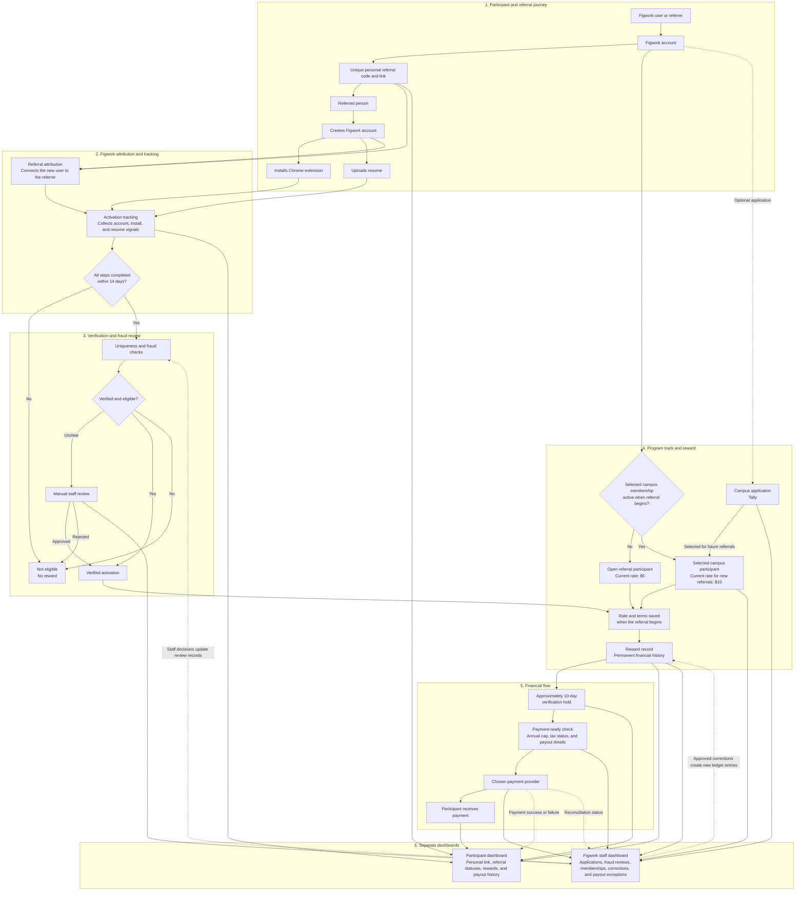
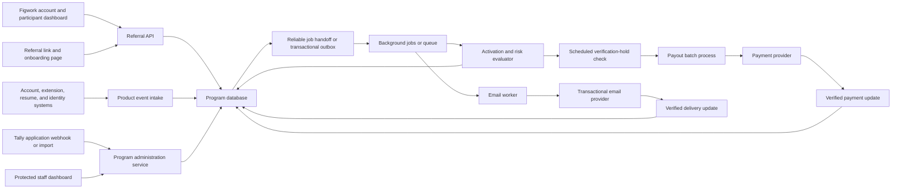

# Referral Program System Diagrams

This file shows the same referral program at two levels:

1. The **program flow** explains what a participant, referred person, and Figwork staff experience.
2. The **engineering architecture** explains which system components exchange data.

The diagrams are complementary. The first is the best starting point for a project owner; the second is for the team that will build the system.

## 1. Program and user flow

### What this diagram means

- Every eligible Figwork user starts with one personal referral link in their account.
- Applying through Tally is optional and is only for selection into the campus program.
- Open and selected-campus participants use the same referral engine; the effective rate is recorded when a referral begins.
- The referred person must create an account, install the extension, and upload a resume within 14 days.
- Fraud and uniqueness checks happen before money becomes payable. Ambiguous cases go to staff review.
- The participant tracker and the internal staff dashboard are different views of the same underlying records.
- The reward history is the financial source of truth. A payment provider moves the money but does not decide whether a reward was earned.

## 2. Engineering system architecture

### Smallest sensible first version

This does not need to begin as a collection of microservices. A practical first version can be:

- One extension to Figwork's existing authenticated backend.
- One relational database or existing product database.
- One reliable background-job mechanism for verification holds, emails, and payout batches.
- One protected internal administration screen.
- Tally for campus applications.
- One managed payment provider.
- One transactional email provider.

The boxes in the diagram are responsibilities, not necessarily separate deployable services.

## Recommended baseline when the existing stack does not decide

The following is a concrete starting point, not a requirement. Reuse a working Figwork capability before adding a new vendor.

| Capability | Preferred starting point | Acceptable alternatives | Reason |
| --- | --- | --- | --- |
| Application and API | Extend Figwork's existing backend in its current language and framework | A small TypeScript API or Worker beside the existing product | Keeps identity, account creation, and product events close to their source |
| Database | Figwork's existing relational database | PostgreSQL if a new database must be chosen | Transactions and unique constraints make reward and cap enforcement easier to reason about |
| Background work | Figwork's existing job runner | Cloudflare Queues plus scheduled Workflows/Cron if Figwork stays on Cloudflare; another durable queue/job system is also fine | Verification holds, email, and payouts must retry safely and remain visible when they fail |
| Campus applications | Keep Tally at launch | A Figwork-owned form later | The current application already exists and does not need to block the referral build |
| Payments | Stripe Connect with hosted onboarding as the first provider to evaluate | Another managed payout platform or Figwork's existing payment workflow | Hosted onboarding can keep bank and identity collection outside Figwork, but Finance and tax counsel must confirm the exact Connect model |
| Transactional email | Figwork's existing provider | Resend or Postmark behind a small adapter | Both the local system and provider request should use stable message keys so retries do not create duplicate mail |
| Staff administration | Add a protected page to an existing internal tool | A small internal app or a managed admin tool | Staff need review and correction controls, not a large custom dashboard at launch |
| Monitoring | Figwork's existing logs, error reporting, and alerts | Any equivalent tools already approved by Engineering | The important outcome is visible failed jobs, payout mismatches, and delayed product events |

Technology references:

- [Stripe Connect overview](https://docs.stripe.com/connect/how-connect-works) and [Stripe-hosted onboarding](https://docs.stripe.com/connect/hosted-onboarding)
- [Cloudflare Queues delivery guarantees](https://developers.cloudflare.com/queues/reference/delivery-guarantees/)
- [Resend idempotency keys](https://resend.com/docs/dashboard/emails/idempotency-keys)

## Decisions this diagram does not make

- The final Figwork backend language or hosting platform.
- Whether the program uses one service or several modules inside an existing service.
- The final payment provider, payout cadence, or tax-filing responsibility.
- The exact fraud model and which cases are manually reviewed.
- The final retention periods for click, identity, application, and financial data.

Those choices should be made during discovery with Engineering, Finance, Tax, Legal, Privacy, and the owners of Figwork's existing systems.
